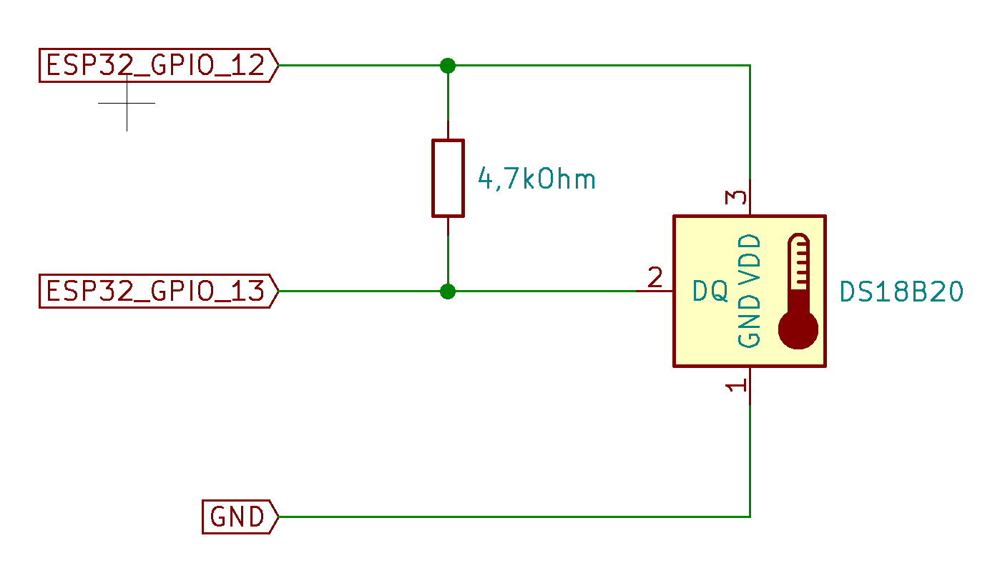

# ESP32 Thermometer
**ESP32** &amp; DS18B20 OLED Thermometer

# Diagram

# BOM

Suggested hardware

* [TTGO ESP32 OLED](https://bit.ly/2G3qTSO)
* [DS18B20](http://bit.ly/2REWdrJ)
* [30AWG Silicone Wires](http://bit.ly/35KMXc2)
* 4,7kOhm resistor